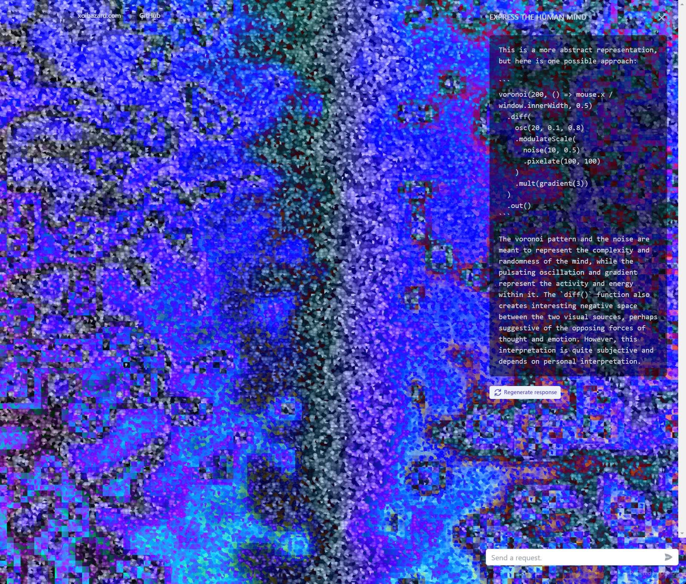
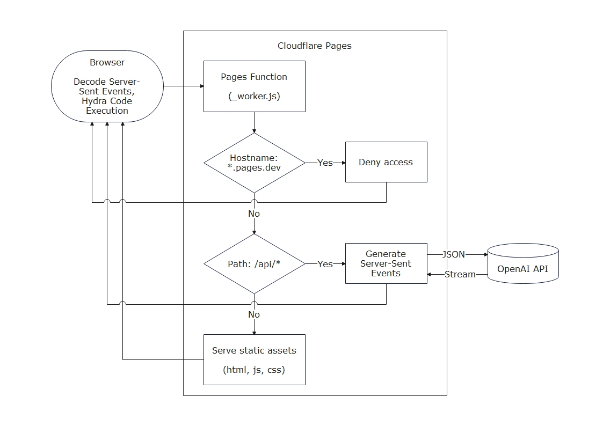

# Hydra Code Generation by GPT-3

Generate Hydra video synthesizer code using the ChatGPT API based on user requests, and execute it in the browser.



## Architecture

The hosting is fully covered by Cloudflare Pages.



## Demo

Check out the live demo of the project at [vj.xoihazard.com](https://vj.xoihazard.com).

## Local development

### Installing Node modules

Run the following command to install the required Node modules:

```
yarn
```

### Building the Cloudflare Pages Function Script

To build the script and generate the `dist/_worker.js` file, which will be executed in Cloudflare Pages Function, run the following command:

```
yarn build
```

### Running Wrangler

To run wrangler, execute the following command, replacing "YOUR_API_KEY" with your actual API key:

```
npx wrangler pages dev ./dist/ -b OPENAI_API_KEY=YOUR_API_KEY
```

### Launching Webpack Dev Server

To run the webpack-dev-server, set the `API_ENDPOINT` environment variable to the Wrangler host and follow the instructions for your specific shell environment:

#### Windows PowerShell

Execute the following command in PowerShell, specifying the Wrangler host:

```
$env:API_ENDPOINT="http://localhost:8788/api/" ; yarn start
```

#### Bash

Run the following command in Bash, specifying the Wrangler host:

```
API_ENDPOINT=http://localhost:8788/api/ yarn start
```

## Deployment to Cloudflare Pages

Set the `OPENAI_API_KEY` as an environment variable, use `yarn build` as the build command, and set the output directory to `dist/`. To protect the API, it's a good idea to limit access from the pages.dev domain using Cloudflare Access and set up rate limiting in the WAF settings for your own domain.